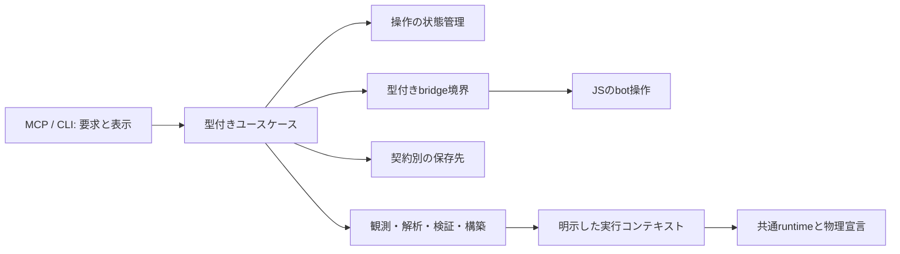

# アーキテクチャ可読性の横断調査

調査基点: `3f44ead`（`codex/coauthoring-architecture`）。
目的: 人間とAIが回路を共同試作するツールとして、既存の責務を追いやすくする。
今回は調査のみ。以下の整理案は未実装であり、新機能・物理法則の変更・実機試験は含まない。

この文書は調査時点の記録。以後の実装済み範囲・保留理由・検証結果は
[初回移行](architecture-migration.md)と[互換経路廃止を含む移行](architecture-cutover.md)を参照。以下の行番号と規模は調査基点に対応する。

## Mineflayer実行経路の廃止とジョブ所有権（2026-10-03 UTC）

現行運用に不要なMineflayerを削除した。Voxrigが既定かつ唯一の実機backendとなり、
旧backend選択は起動時に拒否する。Nodeブリッジ、npm依存、旧実機actorを除去し、
bridge endpointをRustの設定・constructorから除去した。JSON/TCPによる業務テストの
疑似応答は`cfg(test)`専用であり、公開実行経路には組み込まれない。
保存済みの旧実機証拠は[evidence](evidence/legacy-mineflayer/README.md)へ移した。
その解析関数は実機actorと分離した。保存chunkの予約tick読取はPython標準ライブラリへ
移し、Node/Mineflayer依存をなくした。古いchunkを現在のqueueとは扱わない。

プレビュー・待機の結果と旧readbackの補正・試行履歴はRust型となった。
サバイバルジョブは状態別enumで計画または停止済みexecutorとleaseを所有し、公開・保存状態は
その射影とした。開始済みのジョブへ再びstartを送っても、期限やcancel flagで
未開始扱いへ変更できない。native操作の退役・位置確認・再観測の契約は維持する。

検証: 移行途中のMCP全体216件、最終差分のbridge関連19件・survival関連38件が成功。
既定構成と`--no-default-features`のall-target Clippy、formattingが成功した。
保存済みdevice証拠の14試験は、移動前のmock名を修正して最終の1試験を再実行した。
ドア証拠2件と予約tick読取2件も成功。旧証拠14ファイルは移動前とbyte一致する。

`e620f78`の隔離Java 1.21.11試験で、観測・配置・撤去・記録・最大200tickのclient待機を
確認し、最終648セルをサーバーのblock predicateと照合した。backend指定なしの本番MCP
起動と`get_bot_status`がVoxrigを返すこと、旧backend指定の起動拒否も確認した。
補助botの初回視線条件は不一致となり、試験actor自身の既存look APIで向きを指定した
再試験が成功した。元の失敗も保存し、providerへの追加改修・原因の深追いは行っていない。
サバイバル建築は115手順、足場撤去・退避を完走し、別botで3,120セルと位置を照合した。
実行用observerは設定していない。試験・MCP・サーバーはいずれも正常終了した。
[検証記録・原本・hash](evidence/native-only-validation-20261003.json)。
この確認は宣言した隔離fixtureの範囲であり、空のserver queueや任意の建築を保証しない。

内部JSONの撤去全体は未完了。保存codec、Lawのruntime読込、探索比較キー、
診断payload、Voxrigのregistry/outline/component表現は引き続き移行対象である。
Mineflayer RPCを理由とする例外は不要になった。Voxrigの別version adapterは維持し、
外部protocolが要求する形式と内部表現を区別して調べる。必要な例外が判明した場合は相談する。

## JSON境界の段階移行（2026-10-03 UTC）

[移行ロードマップ](json-boundary-migration.md)の第1段階で、設計図コマンドの応答をRust型にした。
認可とdispatchは`service/blueprints.rs`、読取り・生成・採用等の応答は
`blueprint_mcp/response.rs`へ分離した。`get_operation`はBlueprint応答を文字列から再解析しない。
BlueprintUpdatesのarchiveも型付きcatalogを保持し、JSONによる内部往復をなくした。
他のworkflow、診断、保存codec、Law、比較キー、VoxrigのJSONは後続段階に残る。
検証はMCP218件、BlueprintUpdates10件、MCP all-target Clippyとformattingが成功。

第2段階では、挙動report・再構築失敗詳細・ピストン配置reviewを型へ移した。
サバイバルのopaque payloadは残る。native関連型64種類の共有とlive guardの分離が
必要になるため、[Voxrig側の診断データ層の改修案](native-diagnostic-records.md)を作成して
その変更の前で停止している。全JSON移行の完了とは扱わない。

## サバイバル統合後の追補（2026-10-03 UTC）

基点は `fea85f5`（`codex/survival-single-client`）。今回の建築・観測統合に
関係する実装を詳細に読み、加えてcrate内のRustファイルの規模と、MCP入口・物理イベント
処理・建築探索の一部を確認した。以下は今回の対象についての棚卸しであり、全実装の
正しさを保証する監査ではない。後続のA01–A13は最初の調査時点の記録を残している。

| 優先 | 箇所と読みにくさ | 今回の対応／次の整理 |
| --- | --- | --- |
| 1 | 公開サバイバルサービスに計画生成、履歴読取り、開始・実行制御が同居し、責務間を往復する必要があった | 整理済み。中心ファイルを786→353行にし、`planning.rs`、`records.rs`、`execution.rs`へ段階別に分離。Rust DTO・ジョブ所有者・公開入口は中心に残した |
| 2 | 採掘完了処理に結果待ち、履歴判定、接続更新、ワールド照合、再試行判定が続き、どこまで終えたか追いにくかった | 整理済み。採掘処理を`native/mining.rs`へまとめ、結果回収と接続更新を名前付き関数に分離。照合と次の判断を完了処理から読めるようにした |
| 3 | チェックポイントにライブ停止・保存内容の検査・保存済み手順からの所有権再構築・単回消費が同居していた | 整理済み。保存検査を`checkpoint/validation.rs`へ分離し、確認済みprefixからの所有権再構築を独立関数にした |
| 4 | サバイバルジョブの`status["state"]`、manifest、保存済み手順の種別が`Value`と文字列の組合せで判定される | 整理済み。ジョブ状態・イベント・エラー・schema・保存手順・endpoint・単回消費記録をRust enum/structで保持・検査する。配置後・撤去後の保存と別プロセス続行を実機で確認 |
| 5 | `service.rs`は8,071行、約2,400行は末尾のテスト。公開ルーターと遷移試験・配置等の長いワークフローを同じファイルで追う必要がある | 次候補。既存のworkflow部品に合わせ、MCP decode/encodeと手順を分離。テストの機能別分割も行う。ファイル長だけを理由に一括変更しない |
| 6 | 物理エンジンの`step_transition`にイベントの取り出し、順序制約、状態変更、拒否時の巻戻し、trace更新がまとまる | 後続候補。順序制約の検査とaccepted/rejected処理を段階に分ける。キュー順序・論理時刻・巻戻し範囲を保つ検証が必要 |

今回の分割は同じRust crate内で読み進める単位を整えたもの。サービスの依存を新しい
アプリケーション層へ移したり、ジョブ状態を新しい状態機械へ置き換えたりはしていない。
Voxrigの物理・単発操作・接続生命周期と、DustRouteの設計・計画・所有権・ジョブの
分担はそのまま。保存形式、エラー内容、送信前のdurable intent、接続更新順序、
単回checkpoint消費、キャンセル時の不明状態保持を維持する。

実装の入口:
[公開要求](../crates/dustroute-mcp/src/service/survival.rs)、
[計画](../crates/dustroute-mcp/src/service/survival/planning.rs)、
[履歴](../crates/dustroute-mcp/src/service/survival/records.rs)、
[実行制御](../crates/dustroute-mcp/src/service/survival/execution.rs)、
[採掘](../crates/dustroute-mcp/src/survival_execution/native/mining.rs)、
[保存検査](../crates/dustroute-mcp/src/survival_execution/checkpoint/validation.rs)。

整理後の検証: 既存の関連テスト32件が成功（2回の対象指定実行に重複2件を含む）。
明示的な実機試験は通常の単体テスト実行ではignoreのまま。Voxrig有効／既定構成の
all-target Clippy（`-D warnings`）、formatting、差分の空白検査が成功。
さらに整理後の`92db63d`を隔離・非OPのJava 1.21.11実機で再確認し、115手順、
18回の足場撤去・同一アカウント再接続、退避を完走した。完了後の3,120セルと位置は
別botで照合し、試験とサーバーは正常終了した。公開サービスの計画・履歴・実行処理の
本文は、可視性と整形を除いて移動前と一致することも確認した。
[整理後の検証記録と原本](evidence/survival-readability-refactor-20261003.json)。
新しい機能・保存形式変更・保証条件の変更は含まない。

### 内部の文字列・JSON判定の撤去

追加の整理では、サバイバル建築の状態・イベント名・手順種別・拒否コード・保存schemaを
enumへ、manifest・保存済み計画・endpoint・checkpoint消費記録をstructへ置き換えた。
確認済み手順からの足場所有権の再構築は、`RecordedStep`のmatchと型付きeditを使う。
現在のscope・endpointとの照合も型同士で行い、JSON化して比較しない。

MCPとファイル保存の境界では既存の文字列名・JSON形式を使う。プレイヤー名、ブロック名、
エラー説明はデータとして残す。意味を解釈しないネイティブ診断receiptは、中身を参照する
APIを持たない`DiagnosticPayload`に包み、実行や所有権の判断には使わない。
未知の状態・イベント、不正なcheckpointをdecode/検証時に拒否する。

保存用DTOにはネイティブ計画・操作tokenの復元機能を設けない。
`DiagnosticOnly`は保存上のfalseだけを表し、権限復元・自動再送のtrueはdecodeできない。
続行は現在の設計図・ワールド・所持品を再確認して新しい計画を生成する。
Voxrigの責務、送信前のdurable intent、接続退役・更新、単回消費の順序は変更しない。

型の入口:
[ジョブとmanifest](../crates/dustroute-mcp/src/service/survival/model.rs)、
[イベントと履歴](../crates/dustroute-mcp/src/survival_execution/journal.rs)、
[保存用計画と診断専用型](../crates/dustroute-mcp/src/survival_execution/diagnostic.rs)、
[拒否コード](../crates/dustroute-mcp/src/survival_error.rs)。

型移行後の関連テスト37件が成功（実機等の明示実行用6件はignore）。保存形式の不正な
状態・イベント・手順、所有権、権限復元・自動再送フラグ、保存失敗時の進捗の扱いを含む。
Voxrig有効／既定構成のall-target Clippy（`-D warnings`）、formattingと空白検査も成功。
改修前の`92db63d`で保存した実機履歴を別プロセスから読み、診断専用のまま扱えることを
確認した。静的検査で指摘されたジョブenumのサイズ差はcheckpointのBox化で解消した。

型移行後の`7ef4e2f`を隔離・非OPのJava 1.21.11実機で確認した。配置後の境界は
11手順・足場1個を保存して104手順を続行。採掘中に停止を要求した境界は退役・再接続後の
31手順・足場6個を保存して85手順を続行。いずれも別OSプロセスで新しい計画を生成し、
完成・全足場撤去・退避を完走した。完成後の3,120セルと位置を独立照合し、外部変更、
資材不足、重複checkpoint消費の拒否も確認した。試験とサーバーはすべて正常終了した。
[型移行の検証記録と原本](evidence/survival-typed-state-validation-20261003.json)。
今回の撤去範囲はサバイバル建築の内部制御・履歴検査。ワークスペース全体の識別子やcodecの
文字列まで除去したという意味ではない。

## 調査範囲と見方

9 crate の依存宣言と `src` のRustファイル210件を棚卸しし、公開入口、主要データ型、
実行・観測・検証・保存の接続を追った。大きいモジュールは宣言一覧から責務を分け、
該当する実装を確認した。Mineflayerブリッジ、Python計測スクリプト、主要回帰テスト、
開発文書も対象とした。全行の正しさを証明するレビューではなく、構造上の保守負担の調査。
別リポジトリのサーバー計測実装は対象外。

行数はコメント・空行を含む目安。大きさだけで問題とは判定せず、責務・変更箇所・不変条件が
離れている具体例を根拠にした。優先度は整理の効果であり、障害の深刻度ではない。

| 領域 | 主な確認対象 | 結果 |
| --- | --- | --- |
| minecraft | Block、物理定数、device program、Law選択、3系統の実行入口 | A05–A07 |
| physical | 観測範囲、能力、ポート・接続・修復パッチ | A04–A05。観測と推論の区別は維持する |
| ir | 論理・物理・時間・階層の投影 | A05、A08。複数表現には用途の違いがある |
| library | Blueprint定義、Catalog、展開・保存、検証コンテキスト | A09 |
| translate | import/export、解析、コンパイル、挙動検証、配置、飛行生成 | A04、A07–A08 |
| optimize | 配置探索、配線、macro置換、構造・定常・遷移検証 | A10 |
| app | 共通サービスと配置計画 | A01。共通ユースケースを置く場所が既にある |
| mcp | 公開操作、状態管理、観測・診断、保存、bridge | A01–A04、A11–A12 |
| cli | コマンド入口と解析・exportの接続 | 優先して再構成する規模ではない。A03の変換方針は共有できる |
| 検証基盤 | TCP stub、Python観測・比較、JS actor、保存証拠 | A13 |

Cargoのローカルcrate依存に循環は見つからなかった。読みにくさは主に、入口への責務集中、
状態を複数の場所で管理すること、変換・検証境界を型より呼出順やコメントで表すことにある。

## 残る13項目

| ID | 優先 | 対象 | 整理の中心 | 規模の目安 |
| --- | --- | --- | --- | --- |
| A01 | 高 | MCPへのユースケース集中 | 責務分割・依存方向 | 中〜大、段階化可能 |
| A02 | 高 | 操作状態が複数Mapとフラグに分散 | Rust enum・状態所有者 | 中 |
| A03 | 高 | JSONを介した内部呼出・変換 | Rust入出力型・エラー型 | 小〜中、個別移行可能 |
| A04 | 中 | 観測データと検証済み値の境界 | 型・明示的な変換 | 中 |
| A05 | 中 | 宣言の対応関係が分散・番号依存 | 検査付き定数・名前付き参照 | 小〜中 |
| A06 | 中 | Block状態の二重表現とOption集合 | 型付き参照・更新API | 中〜大 |
| A07 | 中 | 実行系の名前・配置と保証範囲 | モジュール境界・モデル選択 | 中。実行系統合は別作業 |
| A08 | 中 | translateの平坦な公開面と解析の集中 | サブシステム別の入口 | 中、段階化可能 |
| A09 | 中 | Blueprint定義・Catalog・展開・保存の同居 | モジュール分割 | 小〜中 |
| A10 | 中 | macro置換の計画・配置・検証の同居 | 手順と責務の分割 | 中 |
| A11 | 中 | Rust–JS間の契約とbot状態の管理 | 型付き通信・境界の分離 | 中 |
| A12 | 中 | 保存方式の差を実装から読み取る必要 | 保存責務と共通I/O部品 | 中 |
| A13 | 低 | 大きな統合テストと機能別scriptへの依存 | 共通harness・試験の分割 | 小〜中 |

### A01: MCPにアプリケーションの仕事が集中している

`service.rs` は全10,184行、末尾のテストmoduleより前だけで7,838行ある。
パラメータ宣言、JSON整形、操作登録、回路探索、修復・最適化、実配置、取消し、
保存との接続までを `DustRouteMcp` が持つ。一方、`DustRouteService` はコンパイル・解析の
薄い入口で、配置以外のワークフローの多くはMCPから切り離せない。

根拠: [状態所有者](../crates/dustroute-mcp/src/service.rs#L97)、
[配置実行](../crates/dustroute-mcp/src/service.rs#L2299)、
[公開入口](../crates/dustroute-mcp/src/service.rs#L3501)、
[appの入口](../crates/dustroute-app/src/lib.rs#L16)。

整理案: 観測、revision編集、配置、修復、最適化、操作管理ごとに責務を分ける。
MCPは要求のdecodeと返却形式を担当し、手順は型付きサービスに置く。
まず同じcrate内で依存を明示し、共通利用できるものをappへ移す。
ファイルを分割しただけで全てが親の `DustRouteMcp` を参照する形にはしない。

### A02: 操作の種類と状態を複数の収納先から推定する

同じUUIDに対して `plans`、`plan_dimensions`、`revision_placements`、`applied_plans` があり、
さらにドア・ピストン・Assembly・遷移試験のMapがある。`show_operation` などは複数のMapを
順番に調べる。`previewed`、`consumed`、`undo_consumed`、状態enumも経路ごとに保持する。
新しい操作を追加すると、登録、表示、実行、取消し、期限処理の対応を離れた箇所で揃える必要がある。

根拠: [Mapと状態](../crates/dustroute-mcp/src/service.rs#L97)、
[操作の振分け](../crates/dustroute-mcp/src/service.rs#L7433)、
[Assemblyでは既にaction enumがある](../crates/dustroute-mcp/src/service/assembly_placement.rs#L42)。

整理案: 操作の種類を表すenumと種類別payloadを用意し、共通の所有者・期限・プレビュー状態を
一つの管理単位にまとめる。実行試行の消費・成功・要再確認を状態遷移の関数で表す。
進捗レポート、短期計画、永続instanceの寿命は別のまま維持する。

### A03: 内部処理が公開JSONの形式に依存している

回路捕捉が公開handlerの文字列をparseして `candidate.seed` と `expansion.limit_reached` を読む。
通常配置のプレビューも返却文字列の `ok` を読み戻して状態を決める。
Blueprint更新要求はRustのstructをJSONにし、fieldを書き換え、別のRust型へdecodeしている。
採用済みsourceの識別情報にも `Value` のfield参照が残る。

根拠: [回路捕捉](../crates/dustroute-mcp/src/service.rs#L3102)、
[プレビューの判定](../crates/dustroute-mcp/src/service.rs#L7517)、
[更新要求の変換](../crates/dustroute-mcp/src/blueprint_mcp.rs#L659)、
[source識別情報](../crates/dustroute-mcp/src/service/assembly_placement/validation.rs#L4)。

整理案: handlerの下に型付き関数を置き、struct同士は `From` / `TryFrom` または明示的constructorで
変換する。source識別情報も保存用recordと現在の解析済みsourceに分ける。
エラーは境界の手前まで種類を保ち、公開エラーへの変換を一箇所にする。
外部通信・保存用のJSONまで排除する必要はない。前回の観測・診断の型移行を広げる対象。

### A04: 生の観測record、検証済み観測、解析用worldの違いが型だけでは分からない

`ConfirmedRegion` は公開fieldを持ち `Deserialize` 可能で、型名だけではvalidate済みと分からない。
実際の `scan_region_confirmed` は要求ID等を検証してから返しており、現在の経路が検証を
省略しているという指摘ではない。
また `world_from_snapshot` はwire形状を補完する一方、`assembly_from_snapshot` は宣言値を保持する。
どちらの目的で変換しているかを、呼出側が覚えておく必要がある。

根拠: [通信recordと検証](../crates/dustroute-mcp/src/bridge.rs#L130)、
[確認済みscan](../crates/dustroute-mcp/src/bridge.rs#L395)、
[異なるsnapshot変換](../crates/dustroute-translate/src/snapshot.rs#L89)、
[正確なexport](../crates/dustroute-translate/src/piston_construction/snapshot.rs#L9)。

整理案: 通信recordと非公開constructorの確認済み値を区別する。
文字どおりの保持、解析用補完、配置用exportを名前と型で区別する。
状態文字列へのexport後に再parseする箇所は、まず共通の型付きnative stateを返す形にできる。
既存の汎用exportと正確な電気状態exportには意味の違いがあるため、関数の単純置換はしない。

### A05: 宣言の対応が一部まだ位置・散在したmatchに依存する

物理・device定数は整っているが、`WorldExecutionContext::for_profile` ではLamp等のLawを
`LAW_IDS[0]`、`[1]`、`[4]`のような番号で選んでいる。配列はdevice定義順から作られるため、
対応を理解するには別ファイルの順番を確認する必要がある。
ブロックの分析上の能力、sceneポート、IR上の役割も別々のmatchにある。

根拠: [Law役割の選択](../crates/dustroute-minecraft/src/execution_context.rs#L228)、
[配列の由来](../crates/dustroute-minecraft/src/device_callback_law.rs#L7)、
[能力](../crates/dustroute-minecraft/src/world.rs#L435)、
[ポート](../crates/dustroute-physical/src/scene.rs#L542)、
[IR上の分類](../crates/dustroute-ir/src/physical_projection.rs#L908)。

整理案: まずLawを名前付き・型付き参照にし、profileの役割表を重複検査できる定数として表す。
分析の分類・ポートは、共通化できる語彙を確認して段階ごとの宣言にまとめる。
物理実行への受理、一般配置、解析の能力は別の契約である。
一つの「対応済み」フラグから全経路を許可してはならない。

### A06: Blockが生の情報と実行状態を同じ可変structで持つ

`Block` は名前・文字列propertiesに加え、facing、powered、power_level、delay、
piston状態等をOptionで保持する。値が存在すべき組合せと、文字列propertiesとの同期を
複数の処理が守っている。deviceの状態更新APIは既にあるが、wireやpistonの更新は別経路にもある。

根拠: [Blockの定義](../crates/dustroute-minecraft/src/world.rs#L350)、
[deviceの状態参照・更新](../crates/dustroute-minecraft/src/device_program/state.rs#L120)、
[wireの更新](../crates/dustroute-minecraft/src/time/piston_runtime/electrical.rs#L262)、
[pistonの更新](../crates/dustroute-minecraft/src/blocks/piston.rs#L1408)。

整理案: 保存・未知ブロック保持のrecordは維持し、実行時は検証済みの種類別viewと更新APIを使う。
新しいfieldを追加したときに同期箇所を探し回らずに済む形にする。
全Blockを一度にenumへ変更すると保存・回転・hash・checkpointにも波及するため、境界から段階化する。

### A07: 実行系の用途とモジュール名が一致しきっていない

現役の `PhysicsEngine`、`RedstoneTickSimulator`、`SynchronousWorldRuntime` は異なる契約を持つ。
固定1×2ドアは前者、真理値表・シナリオ・最適化は互換simulator、動く世界の配置・検証は
同期runtimeを使う。呼出入口からこの対応を追える案内が必要。

同期runtimeの汎用device query/effect処理は `piston_runtime/devices.rs` にあり、
非ピストンのeventも `PistonEvent` に入る。また、汎用executorの子moduleが
`PistonEvent` を直接参照して探索用stateを正規化している。
その比較keyは手書きのfield列をJSON bytesへ変換して作るため、Stateの追加時に
比較対象も更新する必要がある。

根拠: [互換simulatorの明示的契約](../crates/dustroute-translate/src/sim.rs#L400)、
[固定ドアのengine](../crates/dustroute-translate/src/piston_door.rs#L558)、
[共通device実行](../crates/dustroute-minecraft/src/time/piston_runtime/devices.rs#L1)、
[executor内の特化部分](../crates/dustroute-minecraft/src/time/runtime/executor/piston_behavior.rs#L1)。

整理案: まずモデル選択と利用箇所の対応を明示し、Javaの共通callback実行とピストン機械処理を
名前・moduleで区別する。探索の正規化はadapter固有の契約として位置付け、比較用recordを型で表す。
正規化で除く情報、比較の同値性、callback順序は変更しない。
互換simulatorを同期runtimeへ置換する作業は物理・検証結果が変わり得るため別途扱う。

### A08: translateの公開面が平坦で、解析も一箇所に集まりやすい

`translate` は66ファイルの `src` を持ち、rootでコンパイラ、観測、解析、修復、挙動検証、
Blueprint採用、配置、飛行生成の多くを並列に公開する。`world` 等の再exportもある。
`world_reverse.rs` はテスト前だけで1,569行あり、領域解析、入出力推定、真理値表、
予算管理、入力適用、式生成を含む。`analysis.rs` も分類・説明・シナリオ・等価性を扱う。

根拠: [公開面](../crates/dustroute-translate/src/lib.rs#L1)、
[真理値表と領域解析](../crates/dustroute-translate/src/world_reverse.rs#L465)、
[解析facade](../crates/dustroute-translate/src/analysis.rs#L150)、
[複数の解析結果](../crates/dustroute-translate/src/api.rs#L84)。

整理案: compilation、observation/analysis、verification、construction、authoringの
入口と内部moduleを明示する。world_reverseは領域/interface、truth-table、式生成へ分割できる。
既存の物理・論理・時間の投影は証拠と目的が違うため、一つの巨大な結果型へ統合しない。
crateの追加より先にmodule単位で責務を整え、必要なら旧公開pathは限定的な再exportで移行する。

### A09: Blueprintの定義・Catalog・展開・保存が同居する

`library/blueprint.rs` は1,484行あり、IDや定義型、Catalog操作、参照検証、archive、
再帰展開、座標変換を含む。定義を読むだけでもCatalogの大きな実装をまたぐ。

根拠: [定義型](../crates/dustroute-library/src/blueprint.rs#L59)、
[Catalog](../crates/dustroute-library/src/blueprint.rs#L394)、
[archive](../crates/dustroute-library/src/blueprint.rs#L708)、
[展開器](../crates/dustroute-library/src/blueprint.rs#L1272)。

整理案: definitions、catalog、validation、expansion、archiveへ分離する。
これはRust側の責務分割であり、Blueprintの型仕様や採用規則を増やす作業ではない。
immutable ID、親子参照、共有部品、保存データの再検証を維持する。

### A10: macro置換の計画・具体化・検証が一つの実装に集まる

`macro_realize.rs` はテスト前だけで1,736行ある。境界抽出、候補位置決め、配線、支持追加、
所有範囲、Assembly具体化、定常比較、遷移比較を含む。
「候補がある」「構造が合法」「動作が等価」のどこまで進んだかを、複数のreportと関数を追って読む。

根拠: [計画と検証状態](../crates/dustroute-optimize/src/macro_realize.rs#L47)、
[計画](../crates/dustroute-optimize/src/macro_realize.rs#L357)、
[具体化](../crates/dustroute-optimize/src/macro_realize.rs#L716)、
[定常比較](../crates/dustroute-optimize/src/macro_realize.rs#L936)。

整理案: boundary、planning、routing/materialization、verificationの処理へ分け、
段階ごとの入出力を明示する。`safety.rs` / `contract.rs` に既にある採否・安全性判断を使い、
似た判断を新しいmoduleで作り直さない。最適化アルゴリズム自体の変更は別作業。

### A11: Rust–JS間の契約とbotのライフサイクルが分散する

読み戻しの検証は分離済みだが、書込みはRustで `Value` を受け、JS側でfieldや制限を検査する。
method名、payload、返却field、待機上限は両言語で対応を維持する必要がある。
`bridge.js` は接続・再接続、bot状態、録画、移動、書込み、RPC受付を同じmoduleで管理し、
load時に接続を開始する。

根拠: [Rustの書込み入口](../crates/dustroute-mcp/src/bridge.rs#L522)、
[bot状態と接続](https://github.com/sugipamo/DustRoute/blob/9b62dcf/crates/dustroute-mcp/mineflayer/bridge.js#L43)、
[RPC振分け](https://github.com/sugipamo/DustRoute/blob/9b62dcf/crates/dustroute-mcp/mineflayer/bridge.js#L459)。

整理案: Rust要求・応答を型付きにし、共通の契約fixtureでJSとの対応を確認する。
JSは起動入口、bot接続、操作、RPCを分け、明示的に生成した接続状態を渡す。
全処理をプラグイン方式にする必要はない。client tick、serverで確認したtick、
コマンド送信済み、状態確認済みは別の値として保つ。

### A12: 保存方式の違いが実装詳細に埋まっている

短期planはTTL付きの `PlanStateStore`、Blueprintはplayer別Catalogのlockとatomic save、
配置instanceはrevision照合と試行単位のlock・durable saveを使う。
期限・同期・lock範囲が異なり、用途に合う保存先を選ぶには三つの実装を読む必要がある。

根拠: [TTL付き保存](../crates/dustroute-mcp/src/state.rs#L49)、
[Catalog transaction](../crates/dustroute-mcp/src/blueprint_mcp.rs#L734)、
[instance保存](../crates/dustroute-mcp/src/assembly_registry.rs#L232)。

整理案: 保存先ごとの契約を型・moduleで明示し、ファイル権限、容量制限、temporary file、
atomic replacement等の共通部品を抽出する。TTLのある計画と消してはいけない配置履歴を
同じ汎用repositoryへ押し込めない。耐久性・lock範囲の変更が必要なら単なる整理とは分ける。

### A13: 回帰検証の共通基盤が機能別の試験に埋まっている

Assemblyの公開操作テストには一つで約900行のケースがあり、TCP stub、各失敗条件、
採用、保存、診断、再構築をまとめて確認する。失敗した責務だけを調べたり実行する粒度が大きい。
Pythonにも複数の機能別scriptから座標・保存・比較のhelperをimportする構造がある。

根拠: [大きな公開操作テスト](../crates/dustroute-mcp/src/service_blueprint_tests.rs#L353)、
[機能別scriptへの依存](../tools/flying_machine_trial.py#L7)、
[共通化済みのserver管理](../tools/instrumented_server.py#L1)。

整理案: TCP stub・artifact管理・座標・比較projectionを共通harnessへ置き、
責務ごとにテストを分ける。公開API全体を通す代表ケースも残す。
モデルと実機の比較oracleを同じ実装から生成する形にはしない。既存の独立した保存証拠を保つ。

## 維持する構造

- checked Rust定数によるdevice・形状・飛行engineの宣言、今回追加した分類・組立方針。
- RuntimeAdapterのquery/effectと共通queueの分離、exact checkpointと探索用stateの区別。
- 観測と推論、保存済み判定とfresh review、計画と実行権限の区別。
- 既存の `InstanceObservation`、`DiagnosisOutcome`、`ValidatedAssemblyPlacement` の型境界。
- `BehaviorReviewContext` のモデル区別。固定幾何と動く世界の検証結果を混同しない。
- 飛行生成が共通の物理検証・配置・撤去を通る構造。専用runtimeを増やす必要はない。
- 既存のreadback検証、partial progressの記録、独立した実機証拠。

これらは現在の整理の土台として使う。構造を簡単にするために検証段階を減らさない。

## 推奨する着手順

1. **小さい型境界を直す。** A03の更新要求変換・回路捕捉・プレビュー結果、A05の番号依存を
   個別に移行する。公開JSONと結果を保持し、コンパイラが参照先の間違いを検出できる範囲を広げる。
2. **MCPの操作管理を分ける。** A02の状態所有者を整理してから、A01のユースケースと公開handlerを
   分離する。少なくとも所有者、期限、プレビュー、試行消費、途中失敗、取消しを既存試験で固定する。
3. **観測・状態・保存の境界を明示する。** A04・A06・A12を一度に置換せず、readback、native state、
   device更新、履歴保存の順に進める。未知の観測データを保持できることを維持する。
4. **ライブラリ内部を責務別にまとめる。** A08–A10を独立した差分にする。A07は命名・配置の整理から
   始め、モデルや探索の意味が変わる変更を混ぜない。
5. **通信・検証の作業基盤を整える。** A11・A13は関連箇所の移行に合わせて行う。

想定する接続:

今回は実装を開始していない。今後、既存モデルの置換、新しい観測保証、保存形式の互換性変更、
未対応機能の先行実装が必要になった場合は、その差分と理由を報告してから扱う。
コード・実機を変更していないため、ビルド・テストの再実行も行っていない。
