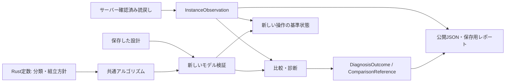

# 共同試作を支えるRustアーキテクチャの整理

目的は、人間が試作・編集した回路をAIと観測・比較・検証できる共通基盤を扱いやすくすること。
Blueprintの型を増やす作業ではなく、Rustの宣言・データ型・実行処理の責務を明示する。
基点は develop の `5dcdb47`。作業ブランチは `codex/coauthoring-architecture`。
サバイバル自動建築とエンティティはユーザー判断で保留。

## 調査結果と移行範囲

| 対象 | 現状 | 今回の扱い |
| --- | --- | --- |
| デバイスの規則・物理特性 | checked Rust定数で宣言済み | 現行アーキテクチャを維持 |
| 飛行エンジンの部品構成 | 型付き定数で宣言済み | 現行アーキテクチャを維持。可変の追加部品・領域は実行時検証 |
| 差分のプロパティ分類 | 診断ループ内の文字列分岐 | 分類を検査付きRust定数表へ分離。未知プロパティの扱いを明示 |
| 組立・撤去の候補優先順 | 別々のmatchに埋め込み | 同じ方針表へ移す。依存関係と物理検証はアルゴリズムに残す |
| 現在の観測結果 | JSON statusとsnapshotを後から読み直して判断 | Rust enumと構造体に移す。保存・公開時にのみJSON化 |
| 比較基準・診断結果 | JSONへ状態・理由・修復情報を詰めてから参照 | Rustの結果型へ移す。観測・比較・修復提案を区別 |
| ピストンの探索・通知順・復元 | 共通runtimeの手続き | 表へ無理に押し込まず維持。今回の物理変更はなし |
| 採用履歴・保存記録 | 定義と証拠を保持し、新しい操作は再検証 | 過去のJSONを現在の観測証拠へ昇格させない境界を維持 |

## 作業順序と完了条件

1. mainを維持し、既存作業をdevelopへ合流。旧作業ブランチをローカル・リモートから除去して新規ブランチを作る。
2. 差分分類と組立方針をRustの定数表へ移す。重複・不正な宣言をconst評価で検出し、既存の分類・順序を保持する。
3. 現在の観測と診断の状態をRust型へ移す。変更中・対象違い・不完全な観測から操作用snapshotを取得できない境界を設ける。
4. 公開JSON・保存形式・採用と撤去の判断を回帰確認。物理runtimeの版は変更せず、実機を起動しない。
5. 型・表・手続きの拡張位置と、今回触らない範囲を記録する。

公開機能、対応ブロック、人的変更の自動採用、権限、修復戦略は増やさない。
宣言した範囲外の機能を先に実装する必要が生じた場合は、着手前にユーザーへ報告する。
Rustビルドは `--offline --locked -j1`、テストは `--test-threads=1` を使う。

## 拡張する場所と境界



### 宣言する規則

- `diagnostic/property_policy.rs`: `PropertyRole` と `RULES` がプロパティ名を
  向き・状態・設定へ分類する。表は `checked` をconst評価し、重複と不正な名前を拒否。
  未知のプロパティは設定差分として残す。これは未対応ブロックを診断するための
  文字どおりの比較であり、ブロックを物理実行へ受理する表ではない。
- `piston_construction/policy.rs`: `ConstructionPolicy` が候補の組立順、撤去順、
  観測面の前提を宣言する。優先度は整数ではなく `BuildPhase` / `RemovalPhase`。
  重複と不適切な観測面・所有本体による撤去の指定をconst評価で拒否する。
  表にない種類には明示した `DEFAULT` を使う。新規種類の物理受理は別に必要。
- `piston_construction/order.rs`: 支持、観測面の先行配置、座標順、撤去時の支持依存を
  ワールドから求める。表は候補の順序だけを与え、各操作は引き続き共通runtimeで検証する。

定数表だけで追加できるのは、既存の語彙で表せる分類・優先順位・依存指定。
新しい作用や通知・参照方式にはRust側の共通プリミティブと実際の挙動の検証が必要になる。
`match` があるという理由だけで表へ移すことはしない。

### 型で保持する状態

- `service/assembly_placement/observation.rs`: `InstanceObservation` の内部enumが
  一致、変更、動作中または変化中、対象違い、観測不足を区別する。
  2回の確認済みサンプルが変化していない場合だけ `stable_baseline` を取得できる。
  変更ありでも差分診断と条件付き再構築の基準にはなり、一致だけが通常撤去の条件になる。
  どちらも空のイベントキューや物理履歴を証明するものではない。
- この型と内部のサンプルは `Deserialize` を実装しない。`last_observation` は
  公開・保存用JSONのまま保持するが、操作に使う型への復元経路を提供しない。
  新しい撤去・再構築は再観測する。型を取得しただけで操作が許可されるわけではなく、
  既存の採用・対象・プレビュー・操作直前の照合も維持する。
- `service/assembly_placement/diagnosis.rs`: `ComparisonReference` が、観測した入力による
  参照状態、初期状態へのフォールバック、再検証できない保存状態、撤去済みを区別する。
  `DiagnosisOutcome` と `ReconstructionOffer` が結果と修復候補を保持し、手順数の
  制限もRustの値に対して確認する。JSONは返却・履歴保存の境界で作る。
- 共有の `diagnostic/report.rs::Diagnosis`、配置の `ValidatedAssemblyPlacement`、
  保存の `PlacedAssembly` は既存の責務を維持する。診断結果は原因・編集意図・所有権を
  自動確定せず、Blueprintへの採用や実世界の書込みを許可する能力にもならない。

### 残した境界

今回の整理対象は共同試作の観測・差分・配置経路。互換実行系や最適化器全体の
表への移行ではない。サーバー応答、公開APIの付加情報、保存済みソースの識別情報には
引き続きJSONがある。`ConstructionSource` は既存の型付きパース境界で再検証し、
`TargetServer` と保存済みの採用情報も従来どおり照合する。

人間の変更を新しい設計として取り込む機能や、比較案を提示するUIを追加したわけではない。
この整理により、それらを追加する際に「現在の観測」「比較基準」「診断」「修復候補」を
混ぜずに共通処理へ接続する位置を明示した。

## 検証

| 確認対象 | 結果 |
| --- | --- |
| 公開MCP・保存後の再検証・観測・診断・撤去・再構築 | 91件合格 |
| 共通診断と未対応ブロックの文字どおりの差分分類 | 5件合格 |
| 不正な定数表のコンパイル拒否 | 5件合格 |
| ドア配置の保存済み回帰、給電、粘着、階段、飛行の組立・生成 | 18件合格 |
| workspace全targetのClippy（警告をエラー化）、fmt、差分の空白検査 | 合格 |

再実行用コマンド:

```sh
cargo test --offline --locked -j1 -p dustroute-mcp --lib -- --test-threads=1
cargo test --offline --locked -j1 -p dustroute-translate --lib diagnostic:: -- --test-threads=1
cargo test --offline --locked -j1 -p dustroute-translate --doc policy -- --test-threads=1
cargo test --offline --locked -j1 -p dustroute-translate \
  --test command_placement_regression --test electrical_piston_construction \
  --test adhesion_construction --test stair_construction \
  --test flying_machine_construction --test flying_machine_generation -- --test-threads=1
cargo clippy --offline --locked -j1 --workspace --all-targets -- -D warnings
cargo fmt --all -- --check
git diff --check
```

実機を使う新規試験は行っていない。公開MCPの操作はローカルの模擬ブリッジで確認し、
配置手順は共通モデルと保存済み回帰資料で確認した。新しい物理挙動の実機一致を
主張する変更ではなく、物理runtime v18・公開JSON・保存形式・操作条件を保つ整理である。

状態: 宣言した移行・119件の回帰検証・静的チェックが完了。ブランチ整理は完了。
