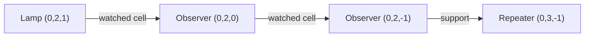

# Reference door: relocation and horizontal rotation

Status: **all eight isolated Java 1.21.11 trials passed**.

## Goal and matrix

Use the adopted ordinary 3×3 reference door on Java 1.21.11, preserving its 43
blocks, materials and completed-operation input assumption. Verify public MCP
construction, two ordinary close/open cycles and conditional removal in all
four horizontal orientations at two target anchors:

- `(65008, 180, 1000)` — positive X, at a chunk boundary.
- `(-65009, 180, 1000)` — negative X, immediately beside a chunk boundary.

Each R0/R90/R180/R270 trial starts with a fully observed empty region, uses an
isolated catalog and registry, freshly adopts the source, and revalidates the
transformed destination. It checks all 43 build and 43 removal stages, four full
region/aperture snapshots, MCP restarts and the existing changed-world,
missing-observation and preview guards. Trials run serially and stop on failure.

## Measured results

| Target X | Rotation | Build stages | Normal close/open cycles | Removal stages |
| --- | --- | --- | --- | --- |
| 65008 | R0 | 43 / 43 | 2 | 43 / 43 |
| 65008 | R90 | 43 / 43 | 2 | 43 / 43 |
| 65008 | R180 | 43 / 43 | 2 | 43 / 43 |
| 65008 | R270 | 43 / 43 | 2 | 43 / 43 |
| -65009 | R0 | 43 / 43 | 2 | 43 / 43 |
| -65009 | R90 | 43 / 43 | 2 | 43 / 43 |
| -65009 | R180 | 43 / 43 | 2 | 43 / 43 |
| -65009 | R270 | 43 / 43 | 2 | 43 / 43 |

All 344 build stages and 344 removal stages passed whole-region readback.
All 32 held-input snapshots matched the complete modeled region and the nine
aperture cells. Each trial also passed the three MCP restarts and existing
preview, external-change and missing-client-chunk guards. Public removal
completed before harness cleanup; every region was empty afterwards, force
loads were removed and each private server stopped normally.

Continuous server captures have consecutive sequences and zero suppressed,
evicted or failed records. All 32 received input packets are paired with their
actual lever writes and state commits. The default bounded trigger still does
not recognize this lever location; its false `input_observed` field is not used
as evidence. The continuous packet/write history establishes the measured
inputs. See [the matrix evidence record](evidence/reference-door-relocation-20260927.json)
for per-trial times, hashes, registry results and capture metadata.

## Placement dependencies

The production planner already selects eligible blocks using support and
occupied-watched-cell precedence. The reference has 43 nodes and 14 edges:
six support edges and eight observer-front edges. An independent static
topological audit found no cycle in any of the eight transformed layouts;
every production insertion order respects all edges.

One chain, shown in source coordinates, mixes both kinds of dependency:



The transformed plans have two distinct insertion orders when expressed back
in source coordinates: R0/R270 share one, and R90/R180 share the other. Both
respect the same dependency graph. Each is still re-simulated at both targets.

The static graph is only one constraint. Installing a block can schedule work,
power a piston or move a dependency. The production planner therefore simulates
each command and requires the exact intended final world and complete teardown.
In particular, the observer initialization that fixed the earlier pre-write
pulse is still needed; sorting the occupied-front edges alone does not address
that command behavior. See [the original failure and repair](reference-door-live-construction.md).

No new placement algorithm, runtime mechanism or physics Law is introduced by
this work. The independent graph check lives in the reference audit example.

## Reproduction

Build serially before starting the private test server:

```sh
cargo build --offline --locked -j 1 -p dustroute-translate --example audit_reference_door_adoption
```

Prepare a transform JSON, for example:

```json
{
  "source_anchor": {"x": 0, "y": 0, "z": 0},
  "target_anchor": {"x": 65008, "y": 180, "z": 1000},
  "rotation": "r90"
}
```

Generate a fresh audit fixture and use a new artifact prefix for every trial:

```sh
target/debug/examples/audit_reference_door_adoption ordinary-target-live-prepare /tmp/door-transform.json > /tmp/door-target.json
python3 tools/observe_assembly_construction.py --run-id reference-door-target-new --x 65008 --rotation r90 --fixture /tmp/door-target.json --persistence --capture-construction
```

The fixture retains the original source catalog/proposal. Its additional probes
are simulated at the actual destination, not obtained by rotating a recorded
successful snapshot. The actor compares complete block states, including dust
arms and device facing, and requires the public plan to equal the target audit.
The existing private instrumented server, bridge dependencies and built MCP
executable are required. The harness verifies unused ports and owns only an
initially empty region in that private world.

## Validation

The 12 command-placement, electrical construction and reference-adoption Rust
regressions passed. Clippy for the changed audit example passed with warnings
denied, along with workspace formatting, actor syntax and diff checks. The
existing source-frame `ordinary-live-prepare` JSON remains equal to its prior
fixture. All production source hashes checked against the completed cleanup
record are unchanged. Rust checks ran serially after the live matrix finished;
both private server/bridge ports were unused afterwards.

## Evidence limits

Client waits remain 100 client ticks per input; actual lever application times
come from server packet/write records. Matching snapshots and these finite
trials do not expose all pending work to MCP, define a minimum safe interval,
or implement a live completion detector. Mid-operation input tolerance remains
outside the accepted ordinary-door contract. This matrix does not claim all
coordinates, surrounding circuits or shared-world building integration.
