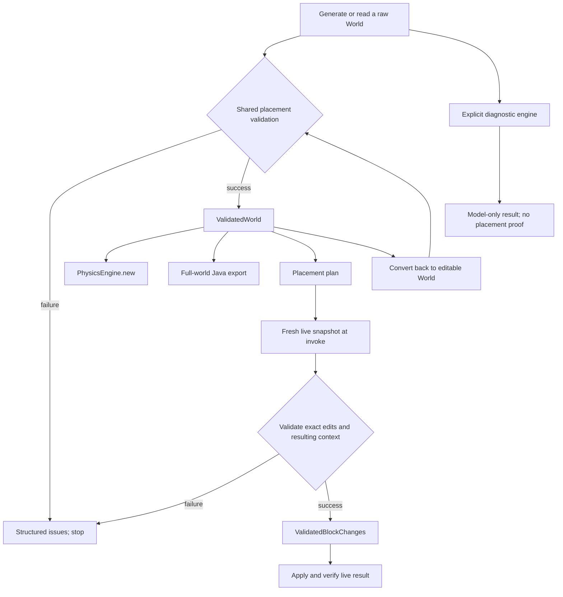

# Mandatory world validation

`World` is an editable model or observation. It does not imply legal placement.
`ValidatedWorld` is immutable evidence that its initial placement passed the
shared support, placement-capability, and explicit block-state checks.



## Enforcement

- The newtype's contents are private. It has no `Deserialize`, `DerefMut`, or
  unchecked constructor. Read-only access is available through `Deref<World>`;
  `into_world()` explicitly discards the proof. Compiler output stores this
  type after its existing routing-legality check, which remains a separate
  prerequisite rather than being replaced.
- `world_setblock_commands`, `isolated_build_commands`, `plan_world_overlay`,
  and `PhysicsEngine::new` require `ValidatedWorld`. Low-level per-block
  formatting is not an approval API and cannot validate world context.
- `PhysicsEngine::new_diagnostic` accepts raw worlds for synthetic models and
  incomplete observations. Event completion remains model bookkeeping, not
  live-equivalence evidence. Diagnostic worlds must pass the shared checks
  before they can be exported or proposed for placement.
- MCP forward placement revalidates the exact edits against a fresh scan
  before writes. Repair/optimization application uses `ValidatedBlockChanges`
  too. Serialized `PlacementPlan` objects are untrusted proposals, so changing
  a plan or reloading it never manufactures a validation proof. Transition
  invocation checks the fresh region against the preview and validates the
  world before activating the input.
- Exact undo, rollback, and restoration are separate recovery paths. They
  restore captured observations, which may intentionally describe a broken
  circuit; they do not certify that observation as a new legal placement.
  Existing confirmation, baseline, region, and post-write checks still apply.

The shared check reuses `World::support_issues()` and block placement
capabilities. It rejects missing support metadata, invalid supports, impossible
support offsets, unsupported placement devices, missing/invalid directional
states and repeater delays, out-of-range power, and a supposedly switched-off
redstone block. It never adds supports or silently substitutes blocks.

MCP mutation scans include one block of surrounding context. A support that
cannot be established within that scan fails validation; clients may need a
broader/full-circuit operation rather than interpreting incomplete evidence as
permission. Validation does not promise a collision-free final circuit in an
arbitrary surrounding world, Vanilla-complete dynamics, physical realizability
of every external driver, or race-free server updates. Existing collision
reports, routing checks, transition policy, and post-write verification remain
necessary. The proof is for the checked initial state, not all future events.

## Piston-door behavior change

The current v1 door scenario uses unsupported wiring and a synthetic
`LeverPulseSequence`. Its `validate_placement`, `run_open`, and `run_cycle`
fail before execution with structured issues, including
`synthetic_input_driver`. A future real controller needs its own input
contract; setting a metadata flag cannot promote this schema.

For model regression and the existing live diagnostic only:

```bash
cargo run -p dustroute-cli -- run-piston-door crates/dustroute-translate/tests/fixtures/3x3_piston_shuttle_fanout.json cycle --diagnostic
```

This returns `execution_mode = "diagnostic"`,
`status = "diagnostic_complete"`, and the failed `placement_validation`.
Without the flag, the CLI returns `world_validation_failed` at stage
`validation`, a nonzero exit status, and no execution trace.

## Regression coverage

Compile-fail examples enforce that raw worlds cannot enter the regular engine
or full-world exporter, and that validated worlds cannot be mutated in place.
Runtime regressions cover loss of support after edits, tampered plan contents,
shared capability/state failures, default door rejection before trace creation,
and the explicitly labelled diagnostic replay. The existing circuit compiler,
semantics export, observation, and repair tests exercise the valid paths.
